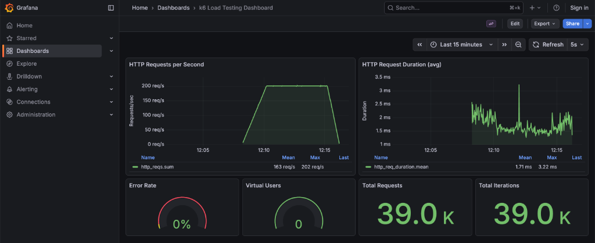

# K6 & TypeScript load tests example

Basic example of K6-based load / performance and stress tests for simple API service, that can be used as a reference & demo in the future.

Feel free to copy the code, play with it and modify the way you want.

Here is an example of the dashboard after the load tests execution:



### API Server
Mock trading platform with user management, market data, and order execution (very naive and super simple API service, just for the demo).

### k6 Load Tests
Comprehensive test suite covering load, stress, and performance scenarios.

## Documentation

| Document | Description |
|----------|-------------|
| [SETUP.md](SETUP.md) | Setup, configuration, and how to run tests |
| [API.md](API.md) | API endpoints reference |
| [LOAD_TESTS.md](LOAD_TESTS.md) | Load testing documentation |
| [STRESS_TESTS.md](STRESS_TESTS.md) | Stress testing documentation |
| [PERFORMANCE_TESTS.md](PERFORMANCE_TESTS.md) | Performance testing documentation |
| [REPORTING.md](REPORTING.md) | Reports and system metrics collection |
| [DOCKER.md](DOCKER.md) | Distributed testing with Docker & Grafana |

## Quick Start

### Distributed Testing with Docker

Run distributed load tests with 4 workers, real-time monitoring, and aggregated metrics:

```bash
# 1. Build k6 tests
npm install
npm run build
npm run test:k6:build

# 2. Run distributed load test (deploys API + 4 workers + Grafana + InfluxDB)
./run-distributed-test.sh trading-scenario

# 3. View real-time metrics in Grafana
open http://localhost:3001/d/k6-load-testing

# 4. Generate HTML report (after test completes)
./scripts/generate-simple-report.sh trading-scenario
```

**What you get:**
- API server running in Docker
- 4 k6 workers generating load in parallel
- InfluxDB storing all metrics
- Grafana dashboard with real-time visualization
- Beautiful HTML report with detailed statistics

**Services:**
- **API Server:** http://localhost:3000
- **Grafana Dashboard:** http://localhost:3001
- **InfluxDB:** http://localhost:8086

**Run different tests:**
```bash
# Load test
./run-distributed-test.sh market-data

# Stress test
./run-distributed-test.sh user-profiles

# Performance test (auto-seeds database)
./run-distributed-test.sh perf-market-latest

# Scale workers
./run-distributed-test.sh user-creation 8  # 8 workers
```

**Stop services:**
```bash
docker-compose down -v --remove-orphans
```

See [DOCKER.md](DOCKER.md) for detailed distributed testing documentation.

---

### Local Testing

Run tests locally without Docker:

```bash
# Install dependencies
npm install

# Start API server
npm run dev

# In another terminal, run tests
./run-tests.sh load        # Load tests
./run-tests.sh stress      # Stress tests
./run-tests.sh performance # Performance tests
./run-tests.sh all         # All tests
```

**View HTML reports:**
```bash
# Reports auto-generated in: reports/TIMESTAMP-testname/report.html
open reports/*/report.html
```

See [SETUP.md](SETUP.md) for detailed local setup instructions.

## Tech Stack

- **Backend:** TypeScript, Express, Node.js
- **Testing:** k6, Webpack
- **Data:** In-memory storage

## Project Structure

```
k6_tests/
├── src/              # API server source code
├── k6/tests/         # k6 load tests
├── *.md              # Documentation
└── *.sh              # Helper scripts
```

## License

ISC - Personal learning project
